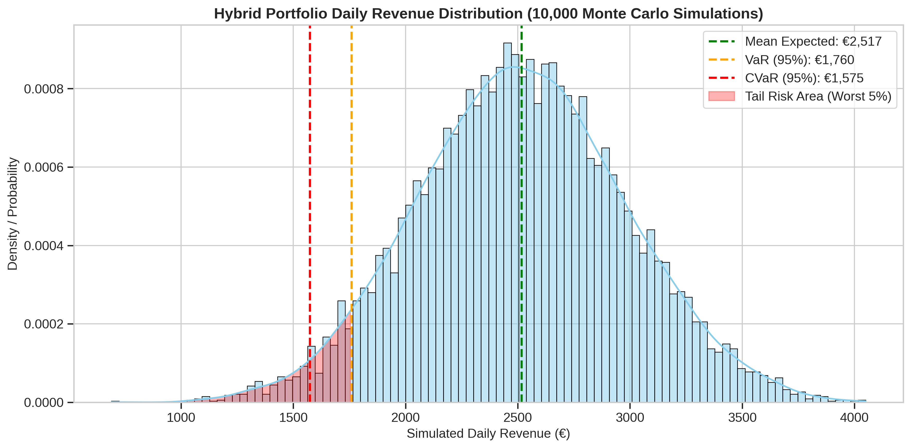

# 🛡️️ Hybrid Asset Portfolio Risk & CVaR Evaluator

[](https://www.python.org/)
[](https://opensource.org/licenses/MIT)
[]()
[](https://hybridportfolioriskevaluator-rrcdxnfnvh2ccvshevaawg.streamlit.app/)

A quantitative risk management framework designed for hybrid energy portfolios (Solar PV + Battery Energy Storage Systems). This tool utilizes **Monte Carlo Simulations** (10,000 scenarios) to stress-test revenue streams across Day-Ahead and aFRR markets, specifically evaluating **Value at Risk (VaR)** and **Conditional Value at Risk (CVaR)**.

---

## 🌐 Live Web Application
Explore the interactive Streamlit dashboard to adjust market volatilities, confidence levels, and run real-time Monte Carlo simulations:
👉 **[Hybrid Portfolio Risk Evaluator App](https://hybridportfolioriskevaluator-rrcdxnfnvh2ccvshevaawg.streamlit.app/)**

---

## 📊 Financial Risk Summary (95% Confidence Level)

| Risk Metric | Value (€) | Description |
| :--- | :--- | :--- |
| **Mean Expected Revenue** | €2,517.00 | The statistical average of daily portfolio returns. |
| **Value at Risk (VaR)** | €1,760.00 | The baseline revenue threshold for the worst 5% of market days. |
| **Conditional VaR (CVaR)** | **€1,575.00** | **The expected average revenue during severe market stress (worst 5%).** |
| **Max Potential Loss** | €942.00 | The maximum expected deviation from the mean in a tail-risk event. |

---

## 📉 Visualizing Portfolio Stress

### Tail Risk & Revenue Distribution
The histogram below illustrates the results of 10,000 simulated trading days, highlighting the "Tail Risk" area where market conditions deteriorate (e.g., low solar irradiance combined with low arbitrage spreads).

<p align="center">
  
</p>

---

## 🏗️ Repository Architecture

```text
hybrid_portfolio_risk_evaluator/
├── .gitignore
├── app.py                             # Interactive Streamlit dashboard
├── README.md                          # Project documentation
├── requirements.txt                   # Dependencies (pandas, numpy, streamlit, seaborn)
├── outputs/
│   ├── portfolio_risk_cvar_analysis.ipynb  # Interactive EDA and simulation logic
│   ├── portfolio_risk_distribution.png     # Exported high-res visualization
│   ├── portfolio_risk_metrics.csv          # Tabular risk metrics
│   └── simulated_revenues_10k.csv          # Raw Monte Carlo simulation data
├── src/
│   ├── __init__.py
│   └── risk_evaluator.py                   # Core OOP simulation and math engine
└── tests/
    ├── __init__.py
    └── test_risk_evaluator.py              # Pytest suite for statistical accuracy
